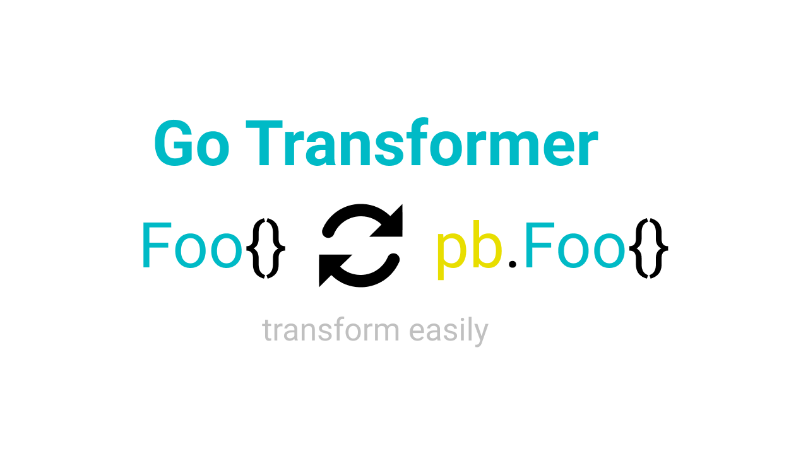

<h1 align="center">Welcome to go transformer 👋</h1>
<p>
  
  <a href="#" target="_blank">
    
  </a>
  
  
</p>

> Bidirectional conversion from protocol buffer stub to struct or otherwise



## Contribute?

https://github.com/muhammadisa/go-transformer/blob/master/CONTRIBUTING.md

## Add to your project

`go get github.com/muhammadisa/go-transformer`

## Need example?

https://github.com/muhammadisa/go-transformer/blob/main/main.go

## Example case?

Let's say you have these definition


##### Definition examples

Protocol buffer definition

```protobuf
message Person {
	string full_name = 1;
	int64 age = 2;
	bool gender = 3;
	repeated Address addresses = 4;
}

message Address {
	float longitude = 1;
    float latitude = 2;
    string address = 3;
}
```

Golang struct definition

```go
type Person struct {
    FullName string
    Age int64
    Gender bool
    Addresses []Address
}

type Address struct {
    Longitude float32
    Latitude float32
    Address string
}
```


##### Struct to proto stub conversion

```go
func conversionStructToProtoc() *pb.Person {
    // person struct
    person := Person{
        FullName: "Misa",
        Age: 21,
        Gender: true,
    }
    // addresses struct
    personAddresses := []Address{
        {
            Longitude: 106.652710,
            Latitude: -6.202394,
            Address: "Tangerang"
        },
		{
            Longitude: 106.865036,
            Latitude: -6.175110,
            Address: "Jakarta"
        },
    }
    // person protocol buffer stub
    personPb := &pb.Person{}
    
    // Transforming person struct into person pb using transformer
    transformer.Transformed{From: &person}.ToProtoc(personPb)
    
    // Transforming person addresses struct into addresses pb using transformer
    for _, address := range personAddresses {
        addressPb := &pb.Address{}
        transformer.Transformed{From: &address}.ToProtoc(addressPb)
        personPb.Addresses = append(personPb.Addresses, addressPb)
    }
    
    return personPb
}
```


##### Proto stub to struct conversion

```go
func conversionProtocToStruct(personPb *pb.Person) Person {
    // person struct
    person := Person{}
    
    // Transforming person pb into struct using transformer
    transformer.Transformed{From: personPb}.ToStruct(&person)
    
    // Transforming person addresses pb into addresses struct using transformer
    for _, addressPb := range personPb.Addresses {
        var address Address
        transformer.Transformed{From: addressPb}.ToStruct(&address)
        person.Addresses = append(person.Addresses, address)
    }
    
    return person
}
```


