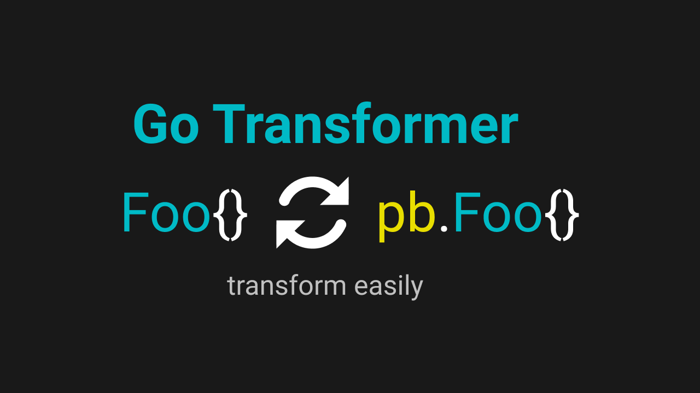

<h1 align="center">Welcome to Epict 👋</h1>

  
  
  
  

> Bidirectional conversion from protocol buffer stub to struct or otherwise

## Contribute?

https://github.com/muhammadisa/go-transformer/blob/master/CONTRIBUTING.md

## Add to your project

`go get github.com/muhammadisa/go-transformer`

## Need Example?

https://github.com/muhammadisa/go-transformer/blob/main/main.go